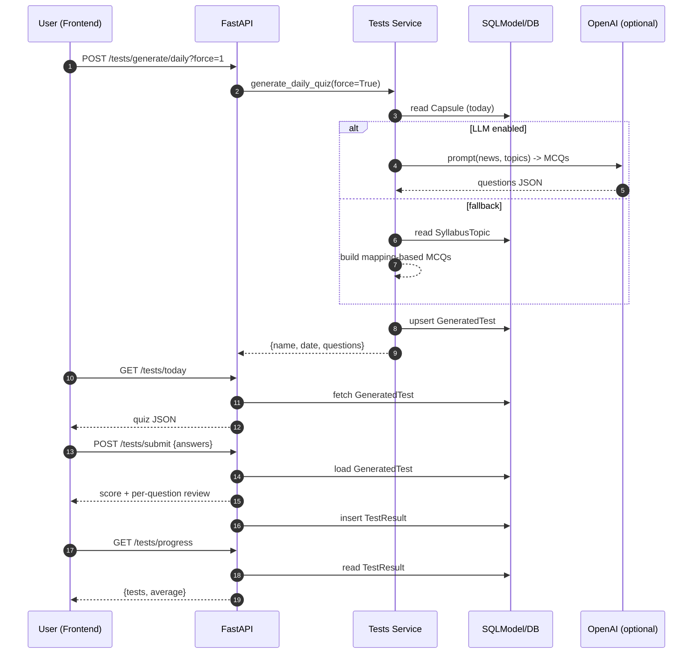

# CivicBriefs.ai — The Autonomous UPSC Preparation Mentor

An agentic, end‑to‑end UPSC platform that ingests daily news, maps items to the UPSC syllabus, links PYQs, generates and adapts study plans, and delivers daily capsules and weekly reports — with a frontend that lets users subscribe, consume, test, and track without Postman/Swagger.

Highlights
- Single entrypoint `autopilot.py` to boot API, scheduler, and agents together
- Frontend‑first flows (subscribe, pipeline, quiz, plan, reports) at `http://localhost:8000`
- LLM‑driven Daily Quiz with explanations and reliable scoring (rule‑based fallback)
- Trend‑aware study plan; recompute prioritizes weak topics and current‑affairs trends
- Email delivery for daily capsules and weekly highlights (SMTP via .env)

---

## Run Locally

1) Setup Python env
```
python -m venv .venv
# Windows PowerShell:
. .venv\Scripts\Activate.ps1
pip install -r requirements.txt
```

2) Configure .env (minimal)
```
DATABASE_URL=sqlite:///data/db.sqlite3
APP_HOST=0.0.0.0
APP_PORT=8000
SECRET_KEY=change-me

# Email (optional for sending)
SMTP_SERVER=
SMTP_PORT=587
SMTP_USERNAME=
SMTP_PASSWORD=

# LLM Quiz (optional but recommended)
OPENAI_API_KEY=
OPENAI_MODEL=gpt-4o-mini

# Scheduler crons (optional)
SCHEDULE_CRON_DAILY="0 6 * * *"
SCHEDULE_CRON_QUIZ="0 7 * * *"
SCHEDULE_CRON_WEEKLY_REPORT="0 8 * * 0"
```

3) Start everything (API + scheduler)
```
python autopilot.py --all
# API: http://localhost:8000   Docs: /docs
```

Alternative (manual)
```
python -m app.main --init-db
uvicorn app.main:app --host 0.0.0.0 --port 8000 --reload
```

---

## Use From Frontend (no Swagger/Postman)

Open `http://localhost:8000`.

- Sign Up / Login from header (first user becomes admin)
- Capsule tab: View Today’s Capsule; Run Pipeline (admin)
- Subscriptions tab: Subscribe/Unsubscribe daily & weekly; Preview/Send Weekly (admin)
- Quiz tab: Load Today’s Quiz → Submit Answers → My Progress (chart)
- Plan tab: Recompute (creates baseline if missing; adapts using quiz/test results)

LLM Quiz
- Set `OPENAI_API_KEY` to enable LLM‑generated MCQs (8–10 questions) with UPSC syllabus‑mapped options, explanations, and sources
- If the LLM isn’t available, a smart fallback uses existing syllabus mappings per news item
- Frontend “Load Today’s Quiz” forces regeneration to always fetch the latest quiz

Emails (optional)
- Set SMTP vars to send daily capsules and weekly reports to subscribers

---

## Scheduler Jobs (via autopilot)
- Daily pipeline (`SCHEDULE_CRON_DAILY`) — ingest → map → plan → report → email
- Daily quiz prep (`SCHEDULE_CRON_QUIZ`) — generate/ensure quiz for the day
- Weekly report (`SCHEDULE_CRON_WEEKLY_REPORT`) — build and email weekly highlights (admin can also trigger in UI)

Run jobs manually
```
python -m app.agents.orchestrator --run-once
python autopilot.py --scheduler
```

---

## Project Structure
```
app/
  main.py                 # FastAPI app & router wiring
  core/                   # config, db, security, deps
  models/                 # SQLModel entities (User, Content, Tests)
  schemas/                # Pydantic I/O models
  services/               # ingest, semantic, capsules, tests, planner, reports, notifier
  agents/                 # News/Mapping/Planner/Reporter + orchestrator
  api/routes/             # REST endpoints (capsule, reports, tests, plan, etc.)
frontend/
  templates/              # index/login/signup/etc.
  static/                 # style.css, main.js
data/                     # sqlite db + seeds
autopilot.py              # unified entrypoint (server + scheduler)
```

## System Flowchart

```mermaid
flowchart TD
  subgraph Client[Frontend (SPA)]
    UI[Tabs: Capsule • Plan • Quiz • Subscriptions • Reports]
  end

  subgraph API[FastAPI Backend]
    R1[/capsule/*/]
    R2[/tests/*/]
    R3[/plan/*/]
    R4[/subscription/*/]
    R5[/reports/*/]
    R6[/admin/*/]
    Auth[JWT Auth]
  end

  subgraph Agents[Agent Orchestrator]
    NA[NewsAgent]
    MA[MappingAgent]
    PA[PlannerAgent]
    RA[ReporterAgent]
  end

  subgraph Services[Domain Services]
    Ingest[services/ingest.py]
    Semantic[services/semantic.py]
    Capsules[services/capsules.py]
    Tests[services/tests.py]
    Planner[services/planner.py]
    Reports[services/reports.py]
    Notifier[services/notifier.py]
  end

  subgraph Store[SQLModel + DB]
    T[Tables:\nUser, StudyPlan, TestResult,\nNewsItem, Mapping, Capsule,\nSyllabusTopic, PyqQuestion,\nGeneratedTest]
  end

  subgraph Sched[APScheduler Jobs]
    J1[Daily Pipeline\n(SCHEDULE_CRON_DAILY)]
    J2[Daily Quiz Prep\n(SCHEDULE_CRON_QUIZ)]
    J3[Weekly Report\n(SCHEDULE_CRON_WEEKLY_REPORT)]
  end

  subgraph Ext[External]
    Feeds[News Feeds (RSS/APIs)]
    SMTP[SMTP Server]
    LLM[OpenAI API]
  end

  %% Client -> API
  UI -- JWT --> Auth
  UI -- Capsule --> R1
  UI -- Quiz --> R2
  UI -- Plan --> R3
  UI -- Subs --> R4
  UI -- Reports --> R5
  UI -- Admin --> R6

  %% API -> Services -> DB
  R1 --> Capsules --> T
  R2 --> Tests --> T
  R3 --> Planner --> T
  R4 --> Notifier
  R5 --> Reports --> T
  R6 --> T

  %% Agents (pipeline)
  NA --> Ingest --> Feeds
  NA --> T
  MA --> Semantic --> T
  MA --> T
  PA --> Planner --> T
  RA --> Reports --> T
  RA --> Notifier --> SMTP

  %% Scheduler triggers agents and quiz
  J1 --> NA
  J1 --> MA
  J1 --> PA
  J1 --> RA
  J2 --> Tests
  J3 --> Reports
  J3 --> Notifier

  %% LLM usage for quiz generation
  Tests -- if OPENAI_API_KEY --> LLM
```

## Quiz Flow (Sequence)



---

## Core Endpoints (for reference)
- Capsule: `GET /capsule/daily`
- Tests:
  - `POST /tests/generate/daily?force=1` — generate/regenerate quiz for today
  - `GET /tests/today` — fetch today’s quiz
  - `POST /tests/submit` — submit answers (auth)
  - `GET /tests/progress` / `GET /tests/history` — track scores (auth)
- Plan:
  - `GET /plan/me` — current user plan (auth)
  - `POST /plan/recompute` — create/adapt plan using results (auth)
- Reports:
  - `GET /reports/weekly` — preview weekly report
  - `POST /reports/weekly/send` — send weekly report (admin)
- Subscriptions:
  - `POST /subscription/subscribe/{email}` / `unsubscribe/{email}`
  - `POST /subscription/subscribe-weekly/{email}` / `unsubscribe-weekly/{email}`

---

## Development Notes
- Keep secrets in `.env`; never commit it
- SQLModel `create_all` for dev; prefer Alembic in production
- Logging via `logging` (no prints in services)
- Services hold I/O boundaries; agents orchestrate services

---

## License
Proprietary by default. Add a license if needed.
